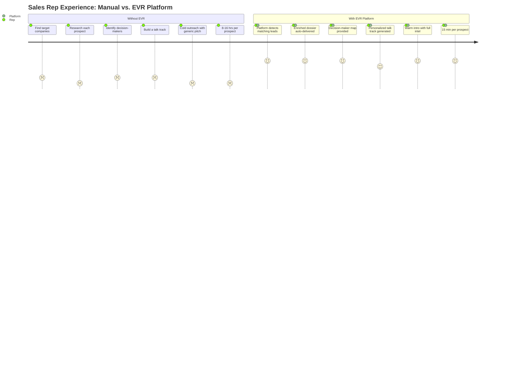
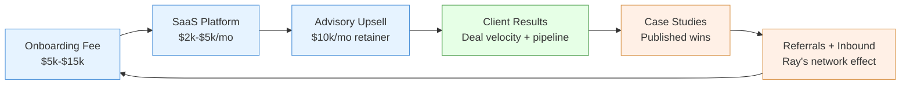
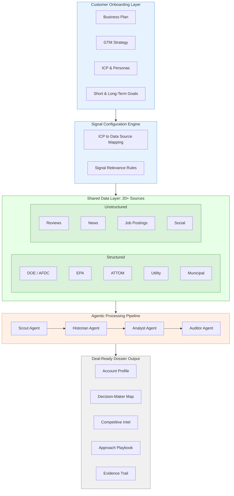

# EVR Business Plan — Customer Acquisition Intelligence-as-a-Service

**Prepared by:** Shai Perednik (Fractional CPTO)

**Date:** March 8, 2026

**Version:** 1.0

**For:** Raymond McSpirit, EVR Advisors

## 1. Executive Summary

EVR Advisors has built a **proven, deal-closing M&A advisory practice** in the EV charging infrastructure space. The internal playbook - distress signal detection, site enrichment, GTM strategy, and gated deal progression - has already produced results, including a landmark Tesla rip-and-replace partnership.

**The opportunity:** Every company selling into the EV charging ecosystem - hardware vendors, software platforms, service providers, capital partners - faces the same problem Ray's team solved internally: **finding the right targets, knowing everything about them, and walking into the first meeting fully prepared.**

This business plan proposes **productizing EVR's customer acquisition playbook** into a configurable **tooling + service layer** that any EV industry sales team can use. The product captures each customer's business context (what they sell, who they sell to, their GTM strategy) and delivers a continuous stream of enriched, deal-ready account dossiers tailored to their specific market.

**The thesis:** *From first touch to deal prep - we accelerate the account team so they show up knowing more than the prospect expects.*

<aside>
💰

**Revenue model:** White-glove onboarding fee + monthly SaaS subscription + optional advisory services. Three revenue layers that compound as the customer base grows.

</aside>

## 2. Market Opportunity

### The EV Charging Infrastructure Boom

- **~10,000 DC fast chargers** currently deployed in the US, with federal mandates to scale dramatically
- **$5B NEVI Formula Program** funding corridor buildout nationwide
- **$7.5B+** in combined federal and state incentives for EV infrastructure
- Massive wave of **distressed and underperforming sites** creating M&A activity across the sector

### The Ecosystem of Buyers

The EV charging value chain is deep. Every company in it has a sales team that needs intelligence:

| **Segment** | **What They Sell** | **Their Sales Problem** |
| --- | --- | --- |
| **Hardware OEMs** | Chargers, connectors, cables, handles, power electronics | Don't know which sites are in buildout phase and actively procuring |
| **Software / Network** | OCPP platforms, payment processing, fleet management | Can't identify operators running fragmented, multi-vendor networks |
| **EPC / Installation** | Site design, electrical, construction, commissioning | Don't know which sites have permits and funding but no contractor |
| **Service / Maintenance** | Uptime SLAs, field service, parts replacement | Can't detect sites with high downtime, bad reviews, aging equipment |
| **Capital / Finance** | Project finance, tax equity, lending | Can't efficiently source de-risked, shovel-ready projects |
| **Utilities** | Grid interconnection, demand response, make-ready programs | No visibility into which developers need capacity and where |

**Every one of these companies is a potential customer.** They all need the same thing: *know who to call, why to call them, and what to say - before the first touch.*

### Market Sizing

- **US EV charging companies (direct TAM):** ~2,000+ companies across the value chain
- **Average sales team size:** 5-20 reps
- **Willingness to pay for sales intelligence:** Established by ZoomInfo ($500M+ ARR), Apollo, Clearbit, 6sense in adjacent verticals
- **EV-specific gap:** No one is building vertical sales intelligence for this industry

## 3. The Problem

### EV Sales Teams Are Flying Blind

Today, a sales rep at an EV hardware company trying to sell charging connectors has to:

1. **Manually search** DOE databases, news articles, LinkedIn, and industry press to find potential buyers
2. **Guess** which sites are in buildout, which operators are expanding, which projects just got funded
3. **Research each prospect** one by one - who's the decision-maker? What's their current vendor? What's their budget cycle?
4. **Craft a cold outreach** with generic messaging because they don't have enough intel to personalize
5. **Repeat this 50-100 times per quarter** with no compounding intelligence

**The result:** Low conversion rates, wasted rep time, missed timing on deals, and zero competitive intelligence.

### Why This Hasn't Been Solved

- **Horizontal sales tools** (ZoomInfo, Apollo) don't have EV-specific data layers (AFDC, EPA brownfields, utility hosting capacity, NEVI corridors)
- **Industry databases** (AFDC Station Locator, DOE datasets) exist but aren't connected to commercial intent signals
- **The data is fragmented** across federal, state, municipal, and commercial sources - nobody has stitched it together for sales use cases

**EVR has already done this stitching for its own deal flow.** The product is making it available to everyone else.

## 4. The Solution

### Customer Acquisition Intelligence-as-a-Service

A **configurable intelligence platform** that ingests each customer's business context and delivers continuously updated, deal-ready account dossiers tailored to how they sell.

### Sales Acceleration: Before vs. After

### How It Works

### Step 0 - Customer Onboarding *(The Configuration Layer)*

When a new client signs up, EVR captures their strategic context through a structured intake:

- **What do you sell?** → Product/service catalog
- **Who do you sell to?** → Target personas (procurement managers, fleet operators, site developers, C-suite)
- **What's your GTM motion?** → Direct sales, channel, field reps, inside sales, partner-led
- **What's your ICP?** → Company size, geography, vertical (transit, retail, fleet, highway corridor)
- **Short-term goals** → "Close 15 new CPO accounts in Q2"
- **Long-term goals** → "Become the preferred hardware supplier for Tesla-certified installers"

This onboarding becomes the **lens** through which the entire intelligence engine operates. Every signal, every enrichment, every playbook is filtered through the client's specific business context.

<aside>
🔑

**Key insight:** The data layer is shared across all customers. The intelligence layer is personalized per customer's onboarding inputs. This is what makes the platform scalable while still feeling bespoke.

</aside>

### Step 1 - Lead Capture & Signal Detection *(Stage 1: Strategic Fit)*

The platform continuously monitors **20+ structured and unstructured data sources** and flags leads that match the customer's configured ICP:

**Structured Data Sources:**

- DOE / AFDC - Station locations, connector types, network operators, utilization
- EPA ACRES & Envirofacts - Brownfield sites, remediation status, institutional controls
- State Voluntary Cleanup Programs - CA EnviroStor, NY DEC, TX TCEQ
- ATTOM / Reonomy - Property distress signals (tax liens, foreclosures, ownership)
- Utility hosting capacity - PG&E GRIP, SCE DRPEP, interconnection queues
- Permitting & zoning - Municipal open data, Zoneomics
- NEVI corridor data - Funding awards, designated corridors, needed locations

**Unstructured Signal Sources:**

- Google/Yelp reviews - Sentiment analysis for distress indicators
- Social media - Operator announcements, hiring signals, executive changes
- News & press releases - Funding announcements, partnership deals, expansion plans
- Job postings - Companies hiring field techs = expanding; hiring bankruptcy counsel = distressed

**The signals change based on what the customer sells:**

| **Customer Type** | **Buying Signals We Detect** |
| --- | --- |
| Hardware vendor | Sites newly permitted, recently funded, in buildout phase (they need to buy hardware NOW) |
| Service / maintenance | Sites with bad reviews, high downtime, aging equipment (distress = their buying signal) |
| Software platform | Operators running 5+ sites on fragmented systems (consolidation = their opportunity) |
| Capital provider | Shovel-ready sites with permits + grid capacity but stalled funding (their sweet spot) |

### Step 2 - Enrichment & GTM Playbook *(Stage 2: Qualification & Deal Prep)*

For every flagged lead, the platform auto-generates an **enriched account dossier** configured to the customer's personas and selling motion:

**Account Dossier Contents:**

- **Company profile** - What they do, size, stage, geography, recent activity
- **Decision-maker map** - Who to contact, title, LinkedIn, email, phone
- **Competitive intel** - Current vendors, contract timing, switching signals
- **Buying signals** - Why NOW is the right time (funding event, expansion, distress)
- **Recommended approach** - Personalized talk track based on the customer's product and the prospect's situation
- **Supporting evidence** - Data provenance showing exactly which signals triggered this recommendation

**Example output for the hardware vendor client:**

<aside>
📄

**Account Dossier: GreenCharge Networks**

**Signal:** 8 new NEVI-funded sites permitted in Ohio corridor (Q1 2026). Currently using BTC Power hardware on 3 existing sites - 2 of which show >15% downtime in AFDC data.

**Decision-maker:** Sarah Chen, VP Procurement (LinkedIn)

**Approach:** Lead with the reliability angle - their current vendor's downtime is costing them NEVI compliance penalties. Your product's uptime SLA directly solves their funding risk.

**Timing:** Procurement for the 8 new sites likely in next 60 days based on construction permit timeline.

**Evidence:** [AFDC utilization data] [Ohio DOT permit records] [NEVI award announcement]

</aside>

## 5. EVR's Proprietary Advantage

### The 8-Stage Gated M&A Framework

EVR's institutional knowledge - codified from years of Ray and Kenny's deal-making experience - is the engine behind the intelligence layer:

1. **Strategic Fit** - Distress detected, opportunity flagged
2. **Technical Convertibility** - Technical validation (e.g., Tesla greenlight, hardware compatibility)
3. **Physical Feasibility** - Site-level engineering check
4. **Economic Survivability** - Financial model validates
5. **Control & Structure** - Acquisition/partnership structure defined
6. **Capital Fit** - Funding aligned
7. **Execution** - Build / implement
8. **Monetization** - Hold, sell, or operate

**For the productized service, Stages 1 and 2 are the core.** The platform automates everything from first signal detection through deal-ready prep - stopping just short of the deal memo. This is the highest-leverage, most repeatable part of the process.

The remaining stages (3-8) become **upsell advisory services** for customers who want EVR's team to help close.

### Why This Is Defensible

1. **Domain expertise codified as software** - Ray and Kenny's heuristics, pattern recognition, and deal instincts are baked into the signal detection and scoring algorithms
2. **Proprietary data synthesis** - No one else has stitched together AFDC + EPA + ATTOM + utility + municipal data into a single EV-specific intelligence layer
3. **Network effects** - Every customer's usage improves the model (which signals actually lead to closed deals)
4. **Switching costs** - Customers configure their entire GTM strategy into the platform; leaving means rebuilding from scratch

## 6. Business Model

### Revenue Flywheel

### Three Revenue Layers

| **Revenue Layer** | **Description** | **Pricing** | **Timing** |
| --- | --- | --- | --- |
| **1. Onboarding & Configuration** | White-glove setup: EVR captures the client's business plan, GTM, personas, goals and configures the intelligence engine | $5,000 - $15,000 one-time | Day 1 |
| **2. SaaS Platform** | Continuous lead detection, enrichment, and dossier generation. Monthly dashboard access with configurable alerts | $2,000 - $5,000/month per seat tier | Recurring |
| **3. Advisory Services** | EVR's team helps interpret intel, coaches account teams, provides GTM strategy consulting, assists on deal progression (Stages 3-8) | $300/hour or $10,000/month retainer | Upsell |

### Unit Economics

| **Metric** | **Value** |
| --- | --- |
| Cost per lead analysis (data + LLM) | ~$1.15 |
| Revenue per dossier (blended) | $50 - $200 |
| Gross margin per analysis | 95%+ |
| Target monthly SaaS ARPU | $3,500 |
| Onboarding revenue per customer | $10,000 (avg) |
| CAC (Ray's network = zero-cost top of funnel) | Low - estimated $2,000-5,000 |
| Target LTV:CAC ratio | >10:1 |

## 7. Traction & Proof Points

### What's Already Been Built and Proven

1. **Tesla rip-and-replace deal closed** - Ray's manual deal engine (Airtable + Pipedrive) sourced a distressed site and matched it with Tesla for acquisition and conversion. This validates the entire signal → enrichment → deal flow pipeline.
2. **8-stage gated framework operational** - EVR's M&A process is codified and actively used across multiple live deals.
3. **Data source inventory completed** - Deep research across 20+ federal, state, and commercial APIs has been conducted and documented. Signal-to-data-source mapping is defined.
4. **Architecture designed** - The 4-layer system architecture (Edge → EVR OS → DataMind → Extensions) is documented and ready for build.
5. **Landing pages shipped** - Persona-specific demos (PE, CRO, HR) for the adjacent Org Mapper product demonstrate the team's ability to ship investor-ready collateral.
6. **Client pipeline active** - Ray has active deals in Pipedrive and an established network of EV industry contacts ready to be first customers.

## 8. Go-to-Market Strategy

### Phase 1: Founder-Led Sales *(Q1-Q2 2026)*

**Channel:** Ray's existing network

**Motion:** Every M&A deal Ray closes is a live demo of the platform's capabilities. The pitch writes itself: *"See how we found this deal? We can set up the same system for your sales team."*

**First 3 customers:**

- Hardware vendor (charging handles, cords, connectors) - already identified
- EPC / installation company in Ray's network
- Capital partner looking for deal flow

### Phase 2: Repeatble Sales *(Q3-Q4 2026)*

**Channel:** Industry events, partnerships, referrals

**Motion:** Case studies from Phase 1 customers → conference talks → inbound

**Target:** 10-15 paying customers by end of Year 1

### Phase 3: Scale *(Year 2)*

**Channel:** Inside sales team + partner channel

**Motion:** Self-serve onboarding for smaller accounts, enterprise sales for large CPOs/OEMs

**Target:** 50+ customers, expand beyond EV charging into adjacent energy infrastructure

### GTM Phasing Timeline

```mermaid
flowchart LR
    subgraph P1["Phase 1: Founder-Led Sales<br>Q1-Q2 2026"]
        direction TB
        P1a["Ray's network"]
        P1b["1-3 customers"]
        P1c["MVP validated"]
        P1d["MRR: $0 to $10k"]
    end

    subgraph P2["Phase 2: Repeatable Sales<br>Q3-Q4 2026"]
        direction TB
        P2a["Events + referrals"]
        P2b["10-15 customers"]
        P2c["Case studies published"]
        P2d["MRR: $30k+"]
    end

    subgraph P3["Phase 3: Scale<br>Year 2"]
        direction TB
        P3a["Inside sales + channel"]
        P3b["50+ customers"]
        P3c["Expand beyond EV charging"]
        P3d["ARR: $1.8M-$3M"]
    end

    P1 --> P2 --> P3

    style P1 fill:#e6f3ff,stroke:#4a90d9
    style P2 fill:#e6ffe6,stroke:#4a9d4a
    style P3 fill:#fff0e6,stroke:#d9944a
```

### Pricing Strategy

**Land:** $2,000/month starter tier (limited leads, basic enrichment)

**Expand:** $5,000/month pro tier (unlimited leads, full dossiers, competitive intel)

**Upsell:** Advisory retainer ($10,000/month) for hands-on GTM coaching and deal support

## 9. Technology & Architecture

### System Overview

### Key Architectural Principles

- **Shared data, personalized intelligence** - One data ingestion pipeline serves all customers; the configuration layer personalizes the output
- **Provenance-first** - Every recommendation traces back to source data (the "Trust Layer" that differentiates from generic AI tools)
- **Modular agents** - Scout, Historian, Analyst, Auditor agents can be independently upgraded or replaced
- **Multi-tenant by design** - Each customer's configuration, leads, and dossiers are isolated

### Tech Stack

- **Orchestration:** Celery + Redis (async task queue)
- **Data store:** PostgreSQL with provenance tracking schema
- **LLM layer:** GPT-4 for enrichment and playbook generation (adapter pattern for provider flexibility)
- **Scraping:** Playwright + Apify fallback for LinkedIn and unstructured sources
- **APIs:** Direct integrations with AFDC, EPA Envirofacts, ATTOM, Reonomy, utility portals
- **Frontend:** React dashboard (Phase 2)

## 10. Team

| **Name** | **Role** | **Focus** |
| --- | --- | --- |
| **Raymond McSpirit** | CEO / Head of Sales | Deal origination, client relationships, industry expertise, GTM strategy. The domain expert whose playbook IS the product. |
| **Kenny** | Head of Sourcing | Lead research, qualification heuristics, pattern recognition. The "rules engine" that powers signal detection. |
| **Dustin** | Product / Infrastructure Lead | EBR infrastructure, operational tools, capital partner interface. Owns the execution side (Stages 3-8). |
| **Shai Perednik** | Fractional CPTO | Architecture, agentic systems, data pipeline design, product strategy. 100hrs/month dedicated to platform build, scaling to full-time as customer base grows. |

### Key Hire (Year 1)

- **1-2 Full-stack developers** - Build and maintain the data pipeline, dashboard, and customer-facing platform

## 11. Financial Projections

### Year 1 - Build & Validate

| **Quarter** | **Milestone** | **Revenue** | **Customers** |
| --- | --- | --- | --- |
| Q1 | Internal tooling MVP; validate on EVR's own deals | Advisory only (~$30k) | 0 (internal use) |
| Q2 | First external customer onboarded; beta launch | $40k (advisory + 1 onboarding) | 1-2 beta |
| Q3 | 3-5 paying customers; product-market fit signals | $75k (onboarding + MRR ramp) | 3-5 |
| Q4 | 10+ customers; case studies published; conference presence | $120k (MRR ~$30k/mo) | 10-15 |
| **Year 1 Total** |  | **~$265k** | **10-15** |

### Year 2 - Scale

| **Metric** | **Target** |
| --- | --- |
| Customers | 50+ |
| MRR | $150k - $250k/mo |
| ARR | $1.8M - $3M |
| Gross margin | 80%+ |
| Team size | 8-12 |

### Cost Structure (Year 1)

| **Line Item** | **Monthly** | **Annual** |
| --- | --- | --- |
| Fractional CPTO | $30,000 - $48,000 | $360k - $576k |
| Developer(s) | $10,000 - $15,000 | $120k - $180k |
| Data APIs & infrastructure | $1,000 - $2,000 | $12k - $24k |
| LLM costs (at scale) | $500 - $1,500 | $6k - $18k |
| **Total Year 1 Costs** | **$41,500 - $66,500** | **$498k - $798k** |

It's expected this project will require 100 hours/month to start (100 hrs = $30k/mo) and would ramp up as clients are onboarded in Year 1 into Year 2, scaling toward full-time at 160 hrs/month ($48k/mo).

## 12. The Ask

### Capital Required

**$498k - $798k for Year 1** (~$41,500 - $66,500/month)

This reflects the true cost of building a production-grade, multi-tenant intelligence platform with 20+ data source integrations, agentic processing, and white-glove customer onboarding.

### Use of Funds

- **69%** - Engineering (CPTO + developer): Architecture, platform build, data pipeline, customer configurations
- **16%** - Data & infrastructure: API subscriptions, hosting, LLM costs
- **15%** - GTM: Sales collateral, conference attendance, first customer acquisition

### Phased Investment Model

The capital requirement scales with the business. A phased approach reduces upfront risk:

| **Phase** | **Duration** | **Focus** | **Monthly Burn** | **Total** |
| --- | --- | --- | --- | --- |
| **Phase 1:** Internal MVP | Months 1-3 | Platform build, data pipeline, architecture | ~$43,000 | $129,000 |
| **Phase 2:** First customers | Months 4-6 | Customer onboarding, configuration layer, iteration | ~$46,000 | $138,000 |
| **Phase 3:** Scale | Months 7-12 | Multi-tenant scaling, dashboard, expanded integrations | ~$48,500 - $66,500 | $291k - $399k |

<aside>
💡

**Self-funding trajectory:** By Month 6, with 3-5 paying customers at $3,500/mo ARPU + onboarding fees, the platform generates $17,500 - $27,500/month in recurring revenue. By Month 9-12, customer revenue should approach or exceed the monthly burn rate, reducing dependency on external capital.

</aside>

### Key Milestones

- **Month 2:** Internal MVP running on EVR's own deal flow
- **Month 4:** First external customer onboarded and generating dossiers
- **Month 6:** 3-5 paying customers with measurable deal velocity improvement
- **Month 9:** $20k+ MRR; case studies published
- **Month 12:** 10-15 customers; $30k+ MRR; approaching self-sustaining or ready for seed round

### Success Metrics

1. **Deal velocity:** 3x improvement in customer's time from lead identification to first qualified meeting
2. **Pipeline generation:** 5x more qualified leads per rep per month vs. manual research
3. **Win rate lift:** 20%+ improvement in close rates due to superior pre-call intelligence
4. **Customer retention:** 90%+ monthly retention (measured by continued platform usage)

## Appendix A: Competitive Landscape

| **Competitor** | **What They Do** | **Why We Win** |
| --- | --- | --- |
| ZoomInfo / Apollo | Horizontal B2B sales intelligence | No EV-specific data layers (AFDC, EPA, utility, NEVI). Generic firmographics don't surface charging infrastructure signals. |
| Industry databases (AFDC, PlugShare) | Raw infrastructure data | Data without intelligence. No enrichment, no GTM playbooks, no personalization to customer's business. |
| Management consultants | Custom research engagements | $50k+ per engagement, weeks to deliver. We deliver continuously at 1/100th the cost. |
| In-house research | Sales reps doing manual research | 8-16 hours per prospect vs. <15 minutes. Doesn't scale, doesn't compound. |

## Appendix B: First Customer Example

**Customer:** EV hardware company selling charging handles, cords, and connectors

**Onboarding inputs:**

- **Products:** CHAdeMO and CCS connectors, charging cables rated 150kW-350kW, mounting hardware
- **ICP:** CPOs with 5+ sites, site developers with active NEVI awards, OEM-certified installers
- **Personas:** VP Procurement, Director of Site Development, Fleet Operations Manager
- **GTM:** Direct field sales (West Coast) + distributor channel (rest of US)
- **Short-term goal:** 15 new accounts in Q2
- **Long-term goal:** Preferred vendor status with 3 major CPOs

**What the platform delivers:**

- Weekly feed of CPOs that just received NEVI funding (they'll need hardware in 60-90 days)
- Alerts when existing charger operators show downtime spikes (replacement hardware opportunity)
- Decision-maker contact info at each target
- Recommended approach: "Lead with your 350kW cable's uptime rating vs. their current vendor's failure rate"
- Evidence: AFDC utilization data + NEVI award records + permit filings

**Result:** Rep walks into the first call knowing the prospect just got funded, knows their current hardware vendor, knows their downtime problem, and has a specific talk track. That's not a cold call - that's a warm introduction.

## Appendix C: Data Sources Inventory

**Federal:**

- DOE AFDC Station Locator API
- EPA ACRES Brownfields Properties
- EPA Envirofacts REST API
- FHWA Alternative Fuel Corridors
- LBNL Queued Up Dataset (interconnection)

**State:**

- CA DTSC EnviroStor
- NY DEC Environmental Remediation
- TX TCEQ Central Registry
- State NEVI corridor designations

**Commercial:**

- ATTOM Property Data API (distress signals)
- Reonomy Property API (ownership, zoning)
- First American DataTree (title, liens)

**Utility:**

- PG&E GRIP (hosting capacity)
- SCE DRPEP (integration capacity)
- [interconnection.fyi](http://interconnection.fyi) (queue tracking)

**Municipal:**

- City open data portals (zoning, permits)
- Zoneomics API (normalized zoning)

**Unstructured:**

- Google/Yelp reviews (sentiment)
- LinkedIn (hiring signals)
- News / press releases (funding, partnerships)
- Job postings (expansion/contraction signals)