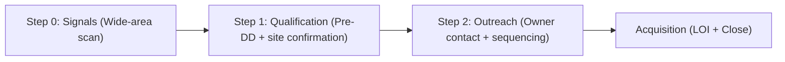
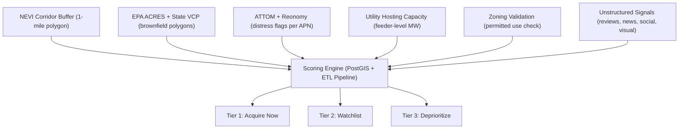
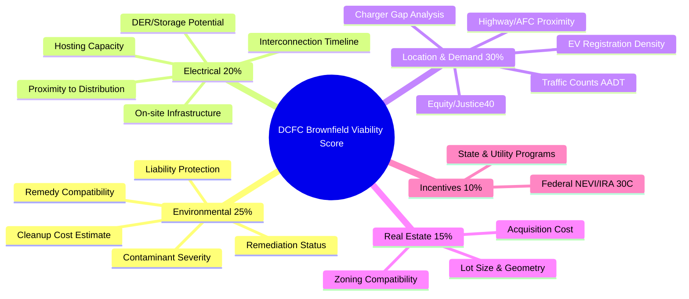
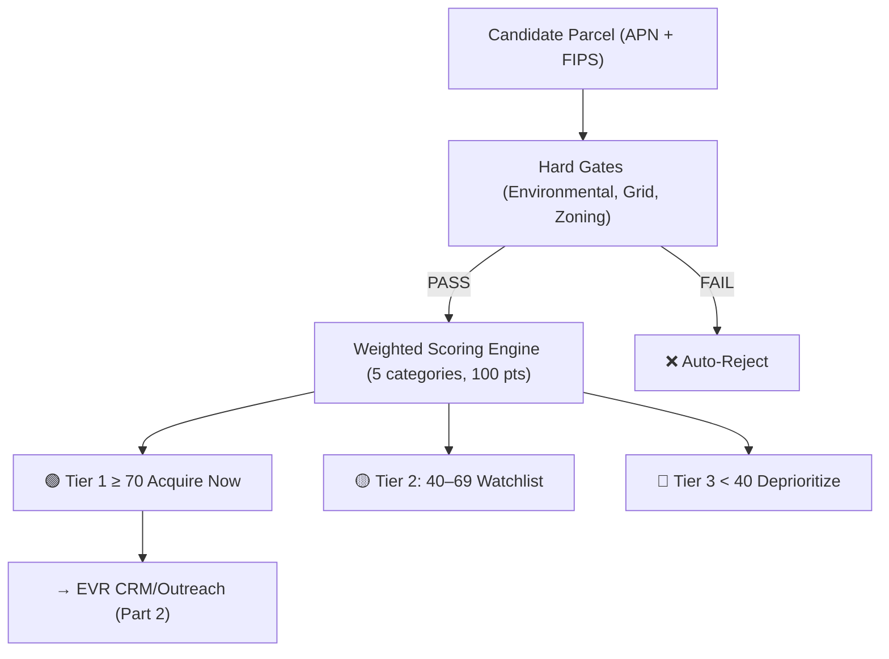

# Part 1 Deliverable: Signal-to-Data-Source Mapping for Brownfield DCFC Acquisition

> **EVR Acquisition Intelligence: Part 1 Deliverable**
> 

> Map every signal we look for to its data source (structured or unstructured). This is the foundation for the automated brownfield site-acquisition pipeline.
> 

---

## Executive Summary

The goal of Part 1 is to identify **where the data lives** so EVR can programmatically surface brownfield sites suitable for DC Fast Charger (DCFC) deployment. The 10,000 DCFC opportunity requires moving from manual scouting to an **automated acquisition intelligence pipeline**.

This deliverable maps **signals → data sources → access methods** across two axes:

1. **Structured data**: Government APIs, environmental databases, real-estate APIs, grid/utility data, zoning portals
2. **Unstructured data**: Review platforms, social media, news, public meeting minutes, visual/geospatial imagery

Signals are further classified by **pipeline stage** (Screening → Lead Gen → Pre-DD → LOI/Close) and **indicator timing** (Leading vs. Lagging).

---

## Pipeline Stage Overview

| Stage | Focus | Primary Data Type |
| --- | --- | --- |
| **Step 0: Signals** | Identify corridors, flag parcels | Structured APIs + unstructured scraping |
| **Step 1: Qualification** | Environmental DD, grid feasibility, zoning | EPA/State VCP + Utility hosting capacity |
| **Step 2: Outreach** | Owner contact, initial offer | CRE APIs (ATTOM, Reonomy) + social signals |
| **Acquisition** | Final underwriting, legal | Title (DataTree), PACER, county records |

---

# Part A: Structured Data Sources

## 1. Federal Energy & EV Infrastructure

These sources establish the **demand baseline** and identify NEVI funding corridors where brownfield parcels become eligible for federal subsidies.

| **Source** | **What It Provides** | **Access** | **Format** | **Update Freq.** | **Pipeline Stage** |
| --- | --- | --- | --- | --- | --- |
| [AFDC Station Locator API (NREL)](https://developer.nlr.gov/docs/transportation/alt-fuel-stations-v1/all/) | Existing EV charger locations, connector types, network operators; identify gaps & "charging deserts" | REST API | JSON, CSV, GeoJSON | Daily | Step 0 |
| [DOE EVI-Pro Lite / EVI-X Modeling](https://driveelectric.gov/files/api-standardized-protocol.pdf) | Demand forecasts: DCFC port requirements per metro/state through 2030 | REST API / Bulk | JSON, CSV | Annual | Step 0 |
| [FHWA Alternative Fuel Corridors](https://developer.nlr.gov/docs/transportation/transportation-incentives-laws-v1/) | NEVI-eligible highway segments; sites within 1-mile buffer qualify for federal funding | ArcGIS REST / Bulk | Shapefile, GeoJSON | Annual | Step 0 |
| [Joint Office / EV-ChART](https://driveelectric.gov/files/ev-chart-data-guidance.pdf) | NEVI compliance tracking, federally funded corridor deployment status | REST API | JSON | Quarterly | Step 0 |
| [State NEVI Corridors (e.g., CA CEC)](https://afdc.energy.gov/corridors) | State-specific "Needed Locations" prioritized for grant distribution | ArcGIS REST / Bulk | Shapefile, GeoJSON, KML | Per solicitation | Step 0 |

**Key insight:** A brownfield parcel inside a NEVI 1-mile corridor buffer is a **Tier 1 target**, eligible for federal subsidies that offset both remediation and interconnection costs.

---

## 2. Federal Environmental (EPA Brownfields)

These sources identify **known brownfield sites**, their cleanup status, and critically, their **Institutional Controls** (ICs). DCFC stations are impervious surfaces that function as engineering caps, making sites with residential-use restrictions *ideal* for EV infrastructure.

| **Source** | **What It Provides** | **Access** | **Format** | **Update Freq.** | **Pipeline Stage** |
| --- | --- | --- | --- | --- | --- |
| [EPA ACRES Brownfields Properties](https://catalog.data.gov/dataset/acres-brownfields-properties) | Polygons/coords for federally funded brownfield cleanups; NFA (No Further Action) status | Web Resource API / Bulk | KMZ, Shapefile, CSV | Periodic | Step 0–2 |
| [EPA Envirofacts REST API](https://www.epa.gov/enviro/web-services) | Query ACRES, SEMS, RCRA, FRS tables; filter by cleanup status, ICs, location | REST API | JSON, CSV, XML | Nightly | Step 0–2 |
| [EPA Institutional Controls Registry](https://www.epa.gov/enviro/data-downloads) | Land-use restrictions: filter for sites that *prohibit* residential but *allow* commercial/industrial paving | Via Envirofacts REST | JSON, CSV | Continuous | Step 2 |
| [Cleanups in My Community (CIMC)](https://www.epa.gov/cleanups/cleanups-my-community#Tables) | Esri map service integrating Superfund, RCRA corrective actions, brownfields boundaries | WMS / Esri REST | Geodatabase | Twice monthly | Step 0–1 |
| [EPA UST Finder](https://experience.arcgis.com/experience/d3a227fc71c04f90bfdce2ca84f79620#zoom_to_selection=true) | Underground storage tank facilities + LUST (leaking UST) sites, former gas stations | Portal / Bulk | Geospatial | Periodic | Step 0–1 |

**Key insight:** Former gas stations with LUST records are the **holy grail**. They sit on prime corner lots with existing curb cuts, commercial zoning, and vehicular ingress/egress already in place.

---

## 3. State-Level Environmental & Voluntary Cleanup Programs (VCPs)

Federal datasets miss the majority of actionable brownfields. **State VCPs** track the bulk of mid-market commercial brownfield parcels and offer liability relief to future buyers.

| **Source** | **What It Provides** | **Access** | **Format** | **Coverage** | **Pipeline Stage** |
| --- | --- | --- | --- | --- | --- |
| [CA DTSC EnviroStor](https://www.envirostor.dtsc.ca.gov/public/data_download) | Hazardous waste site tracking, VCP status, CEQA compliance | ArcGIS REST / Socrata | GeoJSON, CSV | California | Step 0–2 |
| CA GeoTracker (SWRCB) | 285M+ analytical records for 50K+ sites; LUST sites (former gas stations) | Bulk / Advanced Search | Excel, CSV | California | Step 0–2 |
| NY DEC Environmental Remediation DB | Spill incidents since 1978, site boundaries (nightly Shapefiles), IC registry | Socrata OData / Bulk | CSV, JSON, SHP | New York | Step 0–2 |
| TX TCEQ Central Registry | VCP, Municipal Setting Designations (MSDs), corrective actions | Socrata OData V4 | CSV, OData | Texas | Step 0–2 |
| PA DEP Land Recycling (Act 2) | Liability protection tracking for brownfield buyers | Web Scrape / GIS | HTML, Geospatial | Pennsylvania | Step 2 |
| NC DEQ Brownfields GIS | Project boundaries, status, inventory | ArcGIS REST | Feature services | North Carolina | Step 0–1 |

**Key insight:** When a LUST site transitions to "Case Closed" or "NFA Issued," it triggers an immediate acquisition signal. The system must normalize status codes across states into a universal metric.

---

## 4. Commercial Real Estate & Property Distress

These sources detect **motivated sellers** by surfacing financial distress *before* a property hits the open market. Overlaying distress data onto environmental maps creates asymmetric acquisition opportunities.

| **Source** | **What It Provides** | **Access** | **Format** | **Pipeline Stage** |
| --- | --- | --- | --- | --- |
| ATTOM Property Data API | 158M+ properties: tax liens, NOD, Lis Pendens, foreclosure lifecycle, assessed/market values | REST API | JSON, XML | Step 0–1 |
| Reonomy Property API | Ownership (pierce LLC veils), APN, asset categories, CMBS flags, parcel GeoJSON | REST API / Bulk | JSON, NDJSON, GeoJSON | Step 1–2 |
| First American DataTree | Chain of title, deed tracking, lien releases, parcel boundaries (100% US coverage) | Enterprise / Licensed | Proprietary | Step 2–Acquisition |
| CoStar | Verified CRE data: rent, vacancy, comps (no public API) | Proprietary UI only | Internal | Step 2 |
| County Tax Collector Sites | Tax lien sale lists, delinquent property rolls | Portal / Scrape | HTML, PDF, Excel | Step 0–1 |

**Key insight:** When a parcel intersects an EPA-cleared brownfield *and* ATTOM returns active tax liens or a Notice of Default → **Tier 1 Acquisition Target**. Owner is motivated; environmental liability is quantified.

---

## 5. Utility & Grid Interconnection

Grid capacity is the #1 fatal bottleneck. A multi-port DCFC hub needs 1–5 MW. If the feeder can't support it, upgrade costs destroy the deal. Brownfield advantage: former industrial sites often have **legacy heavy-industrial grid connections**.

| **Source** | **What It Provides** | **Access** | **Format** | **Pipeline Stage** |
| --- | --- | --- | --- | --- |
| DOE Atlas of Hosting Capacity Maps | Directory of utility hosting capacity maps (26 states + DC + PR) | Portal (links to utilities) | Interactive maps | Step 2 |
| PG&E GRIP / SCE DRPEP | Sub-feeder hosting capacity, nodal constraints, thermal/voltage limits | Esri ArcGIS API | Geospatial, CSV | Step 2 |
| Berkeley Lab Queued Up Dataset | 10,300+ active interconnection requests across 97% of US capacity; median 4+ year wait | Bulk Download | Excel, CSV | Step 0 (avoid congested zones) |
| PJM Data Miner 2 / ERCOT / MISO APIs | ISO-level transmission queue, congestion zones, POI pre-screening | REST API | JSON | Step 2 |
| GridStatus (Python library) | Standardized access to ISO interconnection queues (NYISO, CAISO, PJM, etc.) | REST (wrapped) | JSON/CSV | Step 2 |
| Utility Hosting Capacity Maps (e.g., ConEd) | Feeder-level EV Load Capacity: binary go/no-go for DCFC | Map Service / Esri | Geospatial | Step 2 |

**Key insight:** If a brownfield sits on a feeder with <1 MW available hosting capacity → **auto-deprioritize**. Upgrade capex destroys IRR regardless of how cheap the land is.

---

## 6. Permitting, Zoning & Municipal Data

The final boolean gate. Even a perfect site is useless if zoning prohibits commercial EV infrastructure.

| **Source** | **What It Provides** | **Access** | **Format** | **Pipeline Stage** |
| --- | --- | --- | --- | --- |
| Zoneomics API | Normalized parcel-level zoning across top 50 MSAs: permitted uses, FAR, setbacks | REST API | JSON, Polygons | Step 2 |
| Gridics Zoning API | By-right development capacity, allowed uses, setbacks, calculated per parcel | REST API | JSON | Step 2 |
| Regrid Parcel API | 150M+ parcels: boundaries (GeoJSON), APNs, NLP-derived zoning, ownership | REST API | GeoJSON | Step 1–2 |
| Municipal ArcGIS Hubs (NYC, Seattle, Detroit, etc.) | Zoning districts, overlays, historic districts, land-use maps | ArcGIS REST / Socrata | JSON, GeoJSON, CSV | Step 2 |
| HUD eGIS Open Data | FHA REO properties, CDBG activity, low-mod income areas | ArcGIS REST | JSON, GeoJSON, SHP | Step 0–1 |

**Key insight:** Municipal data is severely fragmented. Commercial aggregators (Zoneomics, Gridics, Regrid) are the only way to scale nationally without building hundreds of bespoke connectors.

---

# Part B: Unstructured Signals & Scraping Sources

These signals detect distress **before** it shows up in structured databases. They are the early-warning layer of the pipeline.

## 1. Review-Based Signals (Yelp, Google, Social)

| **Signal** | **Why It Matters** | **Data Source** | **Access** | **Indicator Type** |
| --- | --- | --- | --- | --- |
| Declining star rating + rising variance | Service degradation precedes revenue decline by 3–12 months | Yelp Fusion API, Google Places API | REST API | **Leading** (3–12 mo) |
| Drop in review volume / page views | Falling foot traffic shows up as reduced online engagement before formal closure | Yelp business metrics, Google Places | REST API | **Leading** |
| "Closed" / "randomly closed" complaints | Operational unreliability reflects staffing/cash constraints, pre-closure winding down | NLP on review text (keyword rules) | API + NLP | **Leading** |
| Reduced hours / erratic schedule changes | Cutting hours is a classic distress response (labor cost, security) | Google Places `opening_hours`, Yelp hours | REST API (periodic pulls) | **Leading** |
| "Temporarily closed" / "Permanently closed" flags | Direct cessation signal; persistent temp closure = high-value watchlist | Google `business_status`, Yelp `is_closed` | REST API | **Lagging** for closure, **Leading** for redevelopment |
| Fuel quality / environmental complaints | "Bad gas," "water in fuel" = aging infrastructure → may precede LUST events | Review text mining + cross-ref UST/LUST DBs | API + NLP | **Leading** for environmental risk |
| Crime, loitering, safety complaints | Safety issues reduce customer base, raise insurance, trigger code enforcement | Review text, social media, 311 data | API + Manual | **Leading** |

---

## 2. Public Records Signals (Non-API / Scrape)

| **Signal** | **Why It Matters** | **Data Source** | **Access** | **Indicator Type** |
| --- | --- | --- | --- | --- |
| Repeated unresolved code violations | Core blight marker. Chronic neglect precedes condemnation or tax sale | Municipal code-enforcement portals (Socrata, ArcGIS, 311) | API / CSV / Scrape | **Leading** |
| Health department citations | Management breakdown at convenience store attached to station | State/county health inspection portals | Manual / CSV | **Leading** |
| Nuisance / blight / dangerous building designation | City already views it as a problem. Leverage for redevelopment proposals | City blight dashboards, council resolutions | PDF / GIS layers | **Coincident → Leading** for acquisition |
| Property tax delinquency / tax sale | "Most important signal for future abandonment": strong evidence of cash-flow crisis | County treasurer sites, open-data portals | CSV / Scrape | **Strong leading** |
| UCC filings (fuel equipment liens) | Stacked liens = thin equity, vulnerable to shocks | State Secretary of State UCC portals | Manual / Some API | **Leading** for financial stress |
| Bankruptcy filings (operator or entity) | Business cannot service debts → court-supervised sale likely | PACER, bankruptcy court dockets | Manual / Commercial aggregators | **Lagging** for operator, **Leading** for auction opportunity |

---

## 3. News & Media Signals

| **Signal** | **Why It Matters** | **Data Source** | **Access** | **Indicator Type** |
| --- | --- | --- | --- | --- |
| Closure announcements / "last day" articles | Confirms cessation. Early outreach positions ahead of competing buyers | Google News alerts (address + "closing") | Alerts / Scrape | **Lagging** for going concern, **Leading** for acquisition window |
| Contamination / cleanup coverage | Confirms environmental stigma + attracts public subsidies | Google News, EPA press, state agency pages | Alerts / Manual | **Leading** for brownfield opportunity |
| Redevelopment plan coverage | Shows local political will; competing uses may raise land value (timing matters) | City press releases, planning authority sites | Manual | **Lagging** for cheap acquisition, **Leading** for receptive municipalities |
| Brownfield/blight focus area designations | Mapped corridors with supportive policy tools (TIF, grants) | City planning docs, HUD grants, policy reports | PDF / GIS | **Leading** at area level |

---

## 4. Social & Community Signals

| **Signal** | **Why It Matters** | **Data Source** | **Access** | **Indicator Type** |
| --- | --- | --- | --- | --- |
| Neighborhood complaints (crime, nuisance, contamination) | Community pressure triggers enforcement. Owners may sell at discount | Reddit (city subs), Nextdoor, Facebook groups, 311 | Reddit API / Manual | **Leading** |
| Opposition to gas station expansion | Signals policy environment favoring EV-first transitions | Social media, council packet public comments | Manual | **Leading** for siting strategy |
| Rumors of pending closure or sale | Local knowledge surfaces before formal filings, a time advantage | Facebook groups, Nextdoor, Reddit | Manual monitoring | **Leading** (noisy) |
| Station referenced in blight/nuisance public meetings | Officials seeking remedies. External EV reuse proposal welcomed | Council/planning commission minutes (PDFs) | Manual keyword search | **Coincident** |

---

## 5. Visual & Geospatial Signals

| **Signal** | **Why It Matters** | **Data Source** | **Access** | **Indicator Type** |
| --- | --- | --- | --- | --- |
| Boarded windows, canopy damage, overgrown lots | Physical disrepair = core blight indicator, strongly correlates with code violations | Google Street View (manual or ML-based detection) | API / Manual | **Leading → Coincident** |
| Stale Street View in otherwise updated area | May indicate site fenced off, closed, or stalled redevelopment | Google Maps metadata (imagery date stamps) | API / Manual | **Weak leading** (stronger combined) |
| Aerial signs of infra removal / demolition | Fuel infrastructure physically removed. Brownfield transition underway | Google/Bing satellite, change-detection platforms | Imagery API / Manual | **Lagging** for closure, **Leading** for redevelopment |
| Declining nighttime light intensity | Reduced canopy lighting = reduced hours or full closure | NASA/NOAA night-lights datasets | Scientific API | **Leading/Coincident** |
| Proximity to vacancy/blight clusters | Weak micro-markets → higher likelihood of economic obsolescence | Municipal vacancy/blight GIS layers | GIS / API | **Leading** at area level |

---

# Signal-to-Pipeline-Stage Matrix

<aside>
🎯

**How to read this matrix:** Signals on the left feed into the pipeline stages across the top. ✅ = primary use at that stage. The strongest approach is **data fusion**, combining independent signals (e.g., Yelp decline + code violations + LUST record) is far more powerful than any single indicator.

</aside>

| **Signal Category** | **Step 0: Screening** | **Step 1: Qualification** | **Step 2: Outreach** | **Acquisition** |
| --- | --- | --- | --- | --- |
| AFDC / NEVI corridors | ✅ |  |  |  |
| EPA ACRES / Envirofacts | ✅ | ✅ | ✅ |  |
| State VCP / LUST databases | ✅ | ✅ | ✅ |  |
| CRE distress (ATTOM, Reonomy) | ✅ |  | ✅ |  |
| Utility hosting capacity |  | ✅ |  |  |
| Zoning (Zoneomics, Regrid) |  | ✅ |  |  |
| Title / liens (DataTree, PACER) |  |  |  | ✅ |
| Review-based signals | ✅ |  | ✅ |  |
| Code violations / blight | ✅ | ✅ | ✅ |  |
| Tax delinquency / UCC / bankruptcy | ✅ |  | ✅ | ✅ |
| News & media signals | ✅ |  | ✅ |  |
| Social / community signals | ✅ |  | ✅ |  |
| Visual / geospatial signals | ✅ | ✅ |  |  |

---

# Architectural Spine

<aside>
🏗️

**Recommended pipeline architecture**: all sources feed into a unified geospatial database (e.g., PostGIS) keyed on **parcel polygons (APN + FIPS)**. Each data layer attaches attributes to the parcel. A scoring engine ranks parcels across all dimensions.

</aside>

---

# Part C: Site Viability Scoring Rubric (Agent 3)

This rubric provides a **programmatic ranking system** for evaluating candidate brownfield parcels. The rubric assigns a weighted score out of **100 points** across five dimensions. Each variable maps directly to the data sources cataloged in Parts A and B.

<aside>
🧮

**How scoring works:** Each variable is scored 0–5 (or 0–10 depending on weight). Normalize all raw values, apply category weights, and sum. Sites scoring **≥ 70** proceed to active outreach; sites **< 40** are auto-deprioritized. Set a **minimum Environmental score** (e.g., > 50% of category max) as a hard gate: severe contamination is a deal-breaker regardless of other scores.

</aside>

---

## C1. Environmental Factors (25 pts)

Sites must clear a minimum environmental threshold before other scores matter.

| **Variable** | **Max Pts** | **Scoring Criteria** | **Data Source** |
| --- | --- | --- | --- |
| **Remediation Status** | 8 | NFA/Complete: 8 · Remedial Design (Phase III): 6 · Investigation (Phase II): 4 · Assessment only (Phase I): 2 · None: 0 | State VCP DBs, EPA ACRES |
| **Contaminant Type & Severity** | 6 | Low-risk / petroleum-only: 6 · Hazardous but manageable (metals, VOCs): 4 · Complex (PCBs, dioxins, multi-plume): 1 | Phase I/II ESAs, State LUST DBs |
| **Cleanup Cost (% of land value)** | 4 | <$100K or <10% of value: 4 · $100K–$500K / 10–30%: 2 · >$500K / >30%: 0 | Remedial action plans, consultant estimates |
| **Liability Protection** | 4 | Active BFPP + VCP enrollment: 4 · VCP with comfort letter: 3 · Historical only: 1 · None: 0 | EPA BFPP guidance, state VCP statutes |
| **Remedy Compatibility with EV Use** | 3 | ICs/ECs align with paving (cap = station): 3 · Needs vapor mitigation: 2 · Remedy undermined by paving/trenching: 0 | NFA letters, IC registries, remedial action plans |

---

## C2. Electrical Infrastructure (20 pts)

The #1 cost driver. A perfect site with no grid capacity is worthless.

| **Variable** | **Max Pts** | **Scoring Criteria** | **Data Source** |
| --- | --- | --- | --- |
| **Proximity to Medium-Voltage Distribution** | 5 | Adjacent (≤50 ft): 5 · ≤200 ft: 3 · ≤500 ft: 1 · >500 ft / new line needed: 0 | Utility GIS, site survey |
| **Available Hosting Capacity** | 6 | >1 MW available: 6 · 500 kW–1 MW: 4 · 250–500 kW: 2 · <250 kW (major upgrade): 0 | Utility hosting capacity maps (PG&E GRIP, SCE DRPEP, ConEd, DOE Atlas) |
| **Interconnection Timeline & Cost** | 5 | <6 mo & <$50K: 5 · 6–12 mo & $50K–$150K: 3 · >12 mo or >$150K: 0 | Utility queue data, pre-application responses |
| **On-Site Electrical Infrastructure** | 2 | Modern switchgear reusable for DCFC: 2 · Some reuse with upgrades: 1 · Obsolete/undersized: 0 | Facility as-builts, utility service records |
| **DER/Storage Integration Potential** | 2 | Strong PV + BESS potential (manage demand charges): 2 · Marginal: 1 · Infeasible: 0 | NREL PVWatts, site footprint, utility tariff |

---

## C3. Location & Demand (30 pts)

The economic viability layer: will the chargers actually get used?

| **Variable** | **Max Pts** | **Scoring Criteria** | **Data Source** |
| --- | --- | --- | --- |
| **Average Daily Traffic (AADT)** | 6 | >50K ADT: 6 · 25K–50K: 4 · 10K–25K: 2 · <10K: 0 | State DOT AADT, FHWA traffic shapefiles |
| **Proximity to NEVI/AFC Corridor** | 6 | Adjacent to corridor: 6 · ≤0.5 mi: 4 · ≤1 mi: 2 · >1 mi: 0 | FHWA AFC map, state NEVI plans, AFDC |
| **EV Registration Density (3-mi radius)** | 5 | >500 EVs: 5 · 200–500: 3 · <200: 1 | Atlas EV Hub, state DMV, AFDC |
| **Existing DCFC Gap** | 5 | No DCFC within 5 mi: 5 · 1–2 within 5 mi: 3 · 3+ within 5 mi: 1 | AFDC Station Locator API |
| **Corridor Spacing** | 3 | Maintains ~50-mi NEVI spacing: 3 · Moderate redundancy: 2 · Cluster <25 mi from existing: 0 | AFDC Corridor Measurement Tool |
| **Land Use & Trip Attractors** | 3 | Adjacent to retail/food (dwell-time): 3 · Near employment clusters: 2 · Isolated industrial: 0 | OSM POI data, commercial place datasets |
| **Justice40 / Equity Alignment** | 2 | Disadvantaged community + limited charging: 2 · Neutral: 1 · Well-served affluent area: 0 | DOE/EPA Justice40 maps, Census ACS |

---

## C4. Real Estate & Zoning (15 pts)

Physical and regulatory fit.

| **Variable** | **Max Pts** | **Scoring Criteria** | **Data Source** |
| --- | --- | --- | --- |
| **Lot Size & Geometry** | 6 | ≥0.5 acre, regular shape: 6 · 0.25–0.5 acre: 4 · <0.25 acre: 1 · Insufficient: 0 | Regrid Parcel API, county assessor, aerial imagery |
| **Zoning Compatibility** | 5 | Permitted by right: 5 · Conditional use permit needed: 2 · Not permitted: 0 | Zoneomics, Gridics, municipal ArcGIS |
| **Acquisition Cost Benchmark** | 4 | Below market (distress discount): 4 · At market: 2 · Above market: 0 | ATTOM assessed values, Reonomy, broker opinions |

---

## C5. Incentives & Funding (10 pts)

Financial tailwinds that improve project economics.

| **Variable** | **Max Pts** | **Scoring Criteria** | **Data Source** |
| --- | --- | --- | --- |
| **Federal Incentives (NEVI, IRA 30C)** | 6 | NEVI corridor + 30C eligible: 6 · NEVI corridor only: 4 · 30C only: 3 · Neither: 0 | NEVI program guidelines, IRS 30C guidance |
| **State & Utility Programs** | 4 | >$50K in grants/rebates: 4 · $20K–$50K: 2 · <$20K: 0 | DSIRE database, state energy office, utility programs |

---

## Scoring Implementation

### Calculation

The weighted site score formula:

$$S = sum_{i} w_i times frac{v_i}{text{max}_i}$$

Where $w_i$ is the category weight and $v_i$ is the variable score. Total $S$ ranges from **0 to 100**.

### Tiering Thresholds

| **Tier** | **Score Range** | **Action** |
| --- | --- | --- |
| 🟢 **Tier 1: Acquire Now** | ≥ 70 | Immediate outreach to owner; trigger acquisition workflow |
| 🟡 **Tier 2: Watchlist** | 40–69 | Monitor for status changes (remediation progress, new distress signals) |
| 🔴 **Tier 3: Deprioritize** | < 40 | Archive; revisit only if major conditions change |

### Hard Gates (Auto-Fail)

Before running the full score, apply these **binary filters**:

1. **Environmental gate:** If remediation status is "no assessment" AND contaminant severity is "complex" → auto-reject
2. **Grid gate:** If available hosting capacity < 250 kW AND no upgrade path under $500K → auto-reject
3. **Zoning gate:** If EV charging is explicitly prohibited in zone with no variance path → auto-reject

### Pipeline Integration

> 💡 **Note from Agent 3 research:** This rubric is a quantitative starting point. Final viability always requires a **qualitative due diligence phase**: site visits, detailed environmental review, and direct utility engagement. The rubric's value is in **eliminating 90%+ of parcels programmatically** so the team's 4 hours/week go to the highest-value targets.
> 

---

# Vendor Quick-Reference for Call

| **Vendor / Source** | **What They Do** | **Value to EVR** | **Cost** |
| --- | --- | --- | --- |
| **AFDC / NREL** | EV charger locations, gap analysis, connector types | Identifies charging deserts & NEVI corridor gaps, core Step 0 signal | $ |
| **DOE EVI-Pro / EVI-X** | DCFC demand forecasting per metro through 2030 | Validates market sizing for target corridors | $ |
| **FHWA Alt Fuel Corridors** | NEVI-eligible highway segments (1-mi buffer polygons) | Determines federal subsidy eligibility, Tier 1 gating layer | $ |
| **EPA Envirofacts / ACRES** | Brownfield polygons, cleanup status, IC registries | Identifies cleared brownfields ready for acquisition | $ |
| **EPA UST Finder** | Underground storage tank & LUST (leaking UST) sites | Finds former gas stations, holy grail parcels with curb cuts & zoning | $ |
| **State VCP DBs** (CA DTSC, NY DEC, TX TCEQ, etc.) | State-level brownfield tracking, voluntary cleanup status | Catches majority of mid-market brownfields missed by federal data | $–$$ |
| **ATTOM Property Data** | 158M+ properties: tax liens, NOD, foreclosure, assessed values | Surfaces motivated sellers via distress signals *before* market listing | $$ |
| **Reonomy** | Ownership (pierce LLCs), APN, CMBS flags, parcel GeoJSON | Identifies true owners & financial stress on commercial parcels | $$ |
| **First American DataTree** | Chain of title, deed tracking, lien releases, parcel boundaries | Final DD layer for title clearance before LOI | $$$ |
| **CoStar** | Verified CRE data: rent, vacancy, comps | Comp validation for underwriting; no API (manual only) | $$$ |
| **Regrid Parcel API** | 150M+ parcels: boundaries, APNs, NLP-derived zoning, ownership | Parcel geometry + zoning in one call. Backbone for spatial joins | $$ |
| **Zoneomics** | Normalized parcel-level zoning across top 50 MSAs | Scalable zoning check (by-right vs. CUP) without per-city scraping | $$ |
| **Gridics** | By-right development capacity, allowed uses per parcel | Complementary zoning layer; good for setback & FAR checks | $$ |
| **DOE Hosting Capacity Atlas / Utility Maps** | Feeder-level MW availability (26 states) | Binary go/no-go for grid. Auto-deprioritize if <1 MW available | $ |
| **GridStatus (Python lib)** | Standardized ISO interconnection queue access | Avoid congested feeders; estimate interconnection wait times | $ |
| **Yelp Fusion / Google Places** | Reviews, ratings, hours, business status | Leading distress signals 3–12 months before closure | $ |
| **Google Street View** | Visual blight detection (boards, canopy damage, overgrowth) | Confirms physical distress; pairs with ML for automated screening | $–$$ |
| **PACER** | Federal court dockets, bankruptcy filings | Identifies court-supervised sales, an auction acquisition path | $ |

<aside>
💡

**Cost key:** **$** = Free or low-cost API / public data · $$ = Paid SaaS / metered API ($5K–$50K/yr) · **$$$** = Enterprise license / negotiated contract ($50K+/yr)

</aside>

---

# Next Steps

- [ ]  **Confirm weights**: defined across Environmental (25%), Electrical (20%), Location & Demand (30%), Real Estate (15%), Incentives (10%)
- [ ]  **Priority data sources**: identify which 3–5 APIs to connect first for an MVP pipeline
- [ ]  **Data model design**: tables, foreign keys, refresh strategies for the PostGIS spine
- [ ]  **CRM/Ops integration**: connect scored parcels to EVR's outreach workflow (Step 1 → Part 2)